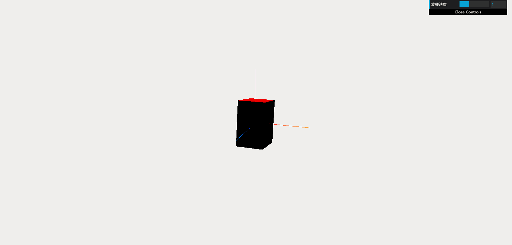
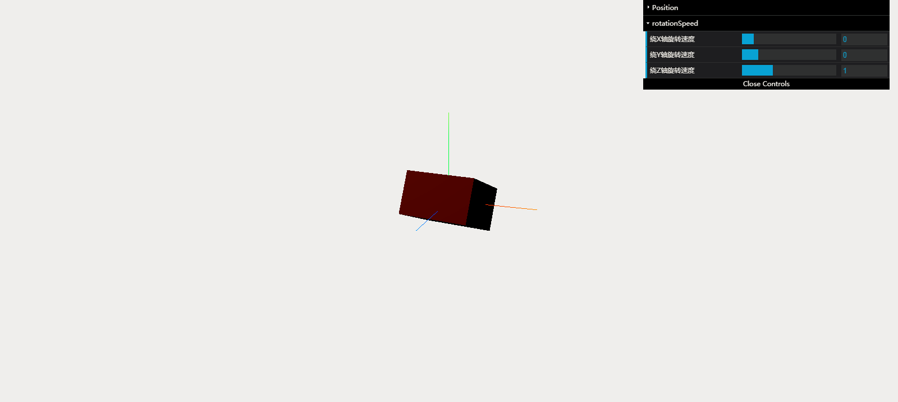
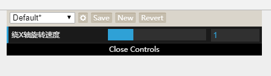
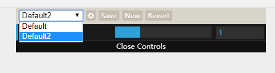
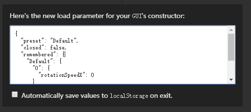
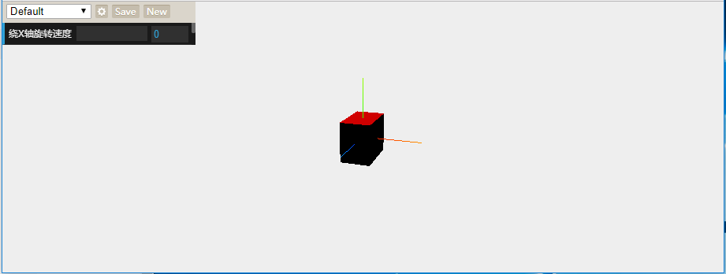
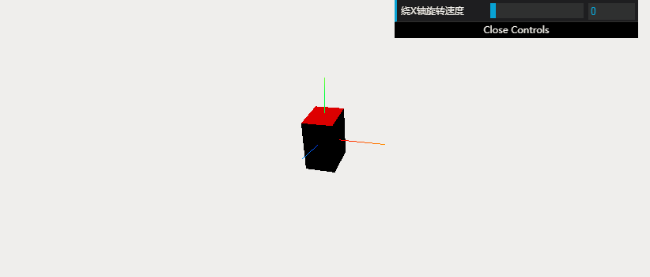
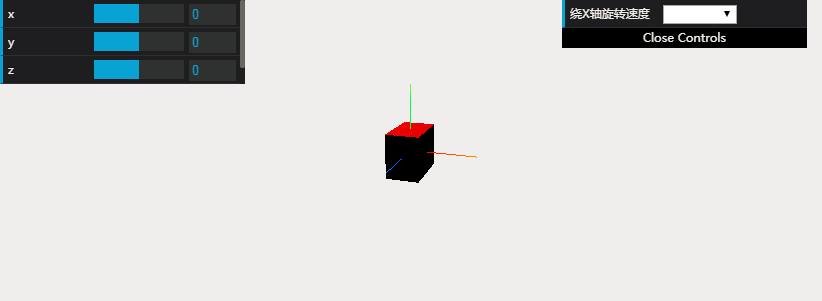

# three.js 插件之 data.gui.js 使用详细
## 4 设置控制项标签文字
* 默认情况下每个控制项左侧的标签显示的是对应的属性名，我们可以通过 name 方法设置成其他的文字（中文也是支持的）
```javascript
	var FizzyText=function()
	{
		this.rotationSpeed=0;
	}
	var text=new FizzyText();
	var gui=new dat.GUI();
	gui.add(text,'rotationSpeed',0,2).name("旋转速度");
```

* [Source Code](demo-4.html)
***
## 5 控制项分组
* 如果控制面板上的项目太多，可以考虑将一些功能近似的控制项分到一个分组文件夹中，这样可以让结构更加清晰。
```js
	var FizzyText=function()
	{
		this.rotationSpeedX=0;
		this.rotationSpeedY=0;
		this.rotationSpeedZ=0;
		this.x=0;
		this.y=0;
		this.z=0;
	}
	var text=new FizzyText();
	var gui=new dat.GUI();
	//第一个分组
	var f1=gui.addFolder('Position');
	f1.add(text,'x');
	f1.add(text,'y');
	f1.add(text,'z');
	//第二个分组
	var f2=gui.addFolder('rotationSpeed');
	f2.add(text,'rotationSpeedX',0,2).name("绕X轴旋转速度");
	f2.add(text,'rotationSpeedY',0,2).name("绕Y轴旋转速度");
	f2.add(text,'rotationSpeedZ',0,2).name("绕Z轴旋转速度");
	//第二个分组默认打开
	f2.open();
```

* [Source Code](demo-5.html)
***
## 6 存储模式
### 开启存储功能模式
* 使用 remember 方法可以开启 GUI 的存储模式（而且可以分组存储）
```js
	var FizzyText=function()
	{
		this.rotationSpeedX=0;
	}
	var text=new FizzyText();
	var gui=new dat.GUI();
	gui.remember(text);
	gui.add(text,'rotationSpeedX',0,2).name("绕X轴旋转速度");
```
### 存储模式介绍
* 存储模式开启后效果如下，每个控制项点击“Revert”按钮可以还原成默认值

* 点击“Save”可以将当前面板设置的值保存成默认值。点击“New”可以新建一个配置分组。
* 通过下拉框可以切换各个分组（分组切换时控制项的值也会随之改变）

* 点击齿轮图标可以看到对应配置分组保存的值
***

***
* 我们也可以把之前保存的分组配置数据在初始化时导入
```js
	var FizzyText=function()
	{
		this.rotationSpeedX=0;
	}
	var text=new FizzyText();
	var gui=new dat.GUI({
        load: {
            "preset": "Default",
            "closed": false,
            "remembered": {
                "Default": {"0": {"rotationSpeedX": 0}},
                "Default2": {"0": {"rotationSpeedX": 0.08045254556882464}}
            },
            "folders": {}
        }
    });
	gui.remember(text);
	gui.add(text,'rotationSpeedX',0,2).name("绕X轴旋转速度");
```
* [Source Code](demo-6.html)
***
## 7 获取面板的DOM对象
* 通过 gui.domElement 我们可以获取到控制面板原生 dom 对象。比如我们将面板位置改成页面左上角

```js
	var FizzyText=function()
	{
		this.rotationSpeedX=0;
	}
	var text=new FizzyText();
	var gui=new dat.GUI();
	gui.remember(text);
	gui.add(text,'rotationSpeedX',0,2).name("绕X轴旋转速度");
	gui.domElement.style="position:absolute;top:0px;left:0px";
```
* [Source Code](demo-7.html)

***
## 8 从 GUI 外部控制配置项
* 如果我们想不通过操作控制面板，而是从外部修改控制项数据。
* 可以让控制项调用 listen 方法，这样当我们改变数据时，也会同步到面板里。
```js
	var FizzyText=function()
	{
		this.rotationSpeedX=0;
	}
	var text=new FizzyText();
	var gui=new dat.GUI();
	gui.add(text,'rotationSpeedX',0,2).name("绕X轴旋转速度").listen();
	setInterval(function()
	{
		text.rotationSpeedX=Math.random();
	},500);
```
* 可以看到控制面板中 speed 项的值每隔 500ms 就会自动改变一次

* [Source Code](demo-8.html)

***
## 9 创建多个 GUI 对象
* 我们可以通过构造函数 dat.GUI() 创建多个 GUI 对象，每个对象对应的都是一个独立的控制面板
```js
	var FizzyText=function()
	{
		this.rotationSpeedX=0;
		this.x=0;
		this.y=0
		this.z=0;
	}
	var text=new FizzyText();

	var gui1=new dat.GUI();
	gui1.add(text,'rotationSpeedX',{'Stopped':0.05,'Slow':1,'Fast':5}).name("绕X轴旋转速度");
	
	var gui2=new dat.GUI();
	gui2.domElement.style="position:absolute;top:0px;left:0px;width:50px";
	gui2.add(text,'x',-10,10);
	gui2.add(text,'y',-10,10);
	gui2.add(text,'z',-10,10);
```
* 我们创建两个 GUI 对象，第一个位于默认的右上角位置，第二个放置在界面左上角。效果图如下：

* [Source Code](demo-9.html)
